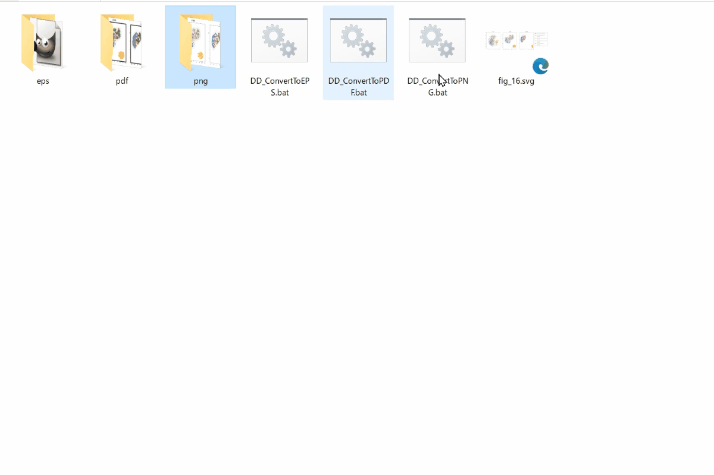
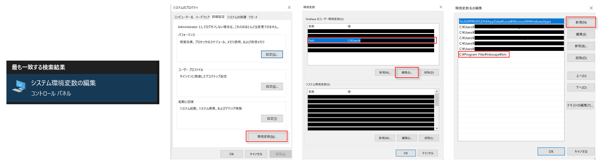

# パワポの図からEPS形式画像の作成(Windows)

パワーポイントで作成した図などをEPSファイルを保存する場合には一手間必要。  
ここでは2種類の方法を紹介

- A. Metafile to EPS Converterを使って画像を変換
- B. Inkscapeを使って画像を変換

## A. Metafile to EPS Converterを使って画像を変換

以下のサイトより「」を入手してEPS形式に変換可能（EMFへの変換も可能）

[https://texwiki.texjp.org/?Metafile%20to%20EPS%20Converter](https://texwiki.texjp.org/?Metafile%20to%20EPS%20Converter)

ただし、アルファチャンネル（透過）が利用できなくなってしまう。

> \[!TIP\]
> クリップボードからの変換が可能だからめっちゃ楽


## B. Inkscapeを使って画像を変換

パワーポイントからSVG形式で保存後にInkscapeを利用してSVGに変換する。

Inkscapeを利用してドラッグ・アンド・ドロップ（D&D）でSVG画像をEPSに限らず他の形式に変換可能。  
さらに、複数ファイル同時に実行可能。  



### 利用方法

1. Inkscapeコマンドが利用可能なことを確認（インストール手順は後述）
1. パワポの図をSVGで保存
1. scriptsに保存されているbatファイルをSVG画像が格納されているフォルダにコピー
1. SVG画像をbatファイルにドラッグ・アンド・ドロップ（複数ファイルでも可）
1. 変換後の画像が拡張子名のフォルダに保存される


> \[!TIP\]
> 他の形式を利用したければbatファイルを編集すれば良い

### Inkscapeをコマンドから利用可能にする方法

#### 1. Inkscapeのダウンロード・インストール

以下のInkscape公式サイトからダウンロードしてインストールする。   
（執筆時2024/03/19でversion 1.3.2）  

<!-- リンクを挿入 -->
[https://inkscape.org/release/inkscape-1.3.2/windows/64-bit/msi/?redirected=1](https://inkscape.org/release/inkscape-1.3.2/windows/64-bit/msi/?redirected=1)


#### 2. InkscapeのPathを通す

1. Windowsのシステムの詳細設定を開く（Win+Sで検索窓 → 「path」と入力されればサジェストに「システム環境変数の編集」出る）
1. 「環境変数」→「Path」→「環境変数名の編集」→「新規」で新たなPathを入力
1. Inkscapeのアプリが保存されているフォルダのPathを通す（おそらく「C:\Program Files\Inkscape\bin」）



#### 3. 確認

Windowsのコマンドライン（コマンドプロントやPowerShell）でinkscapeコマンドが利用可能か確認する。

```
# 入力
> inkscape --help
```
```
# 出力
Help Options:
  -?, --help                                 Show help options
  --help-all                                 Show all help options
  --help-gapplication                        Show GApplication options
  --help-gtk                                 Show GTK+ Options

Application Options:
  -V, --version                              Print Inkscape version
  --debug-info                               Print debugging information
  --system-data-directory                    Print system data directory
  
  ...

```
